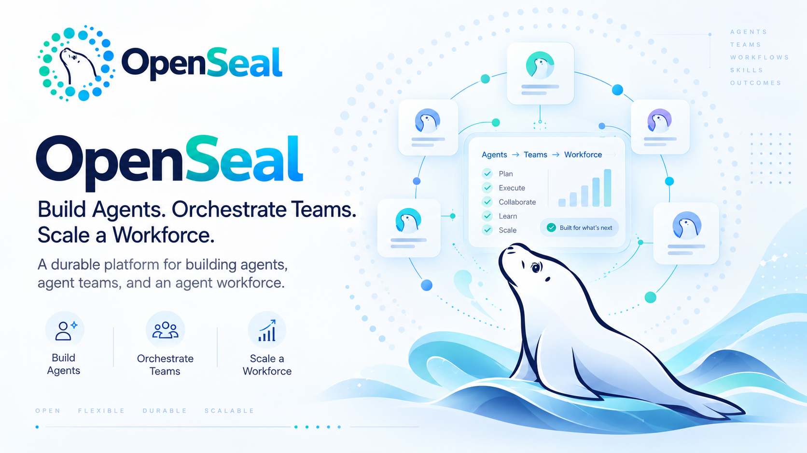
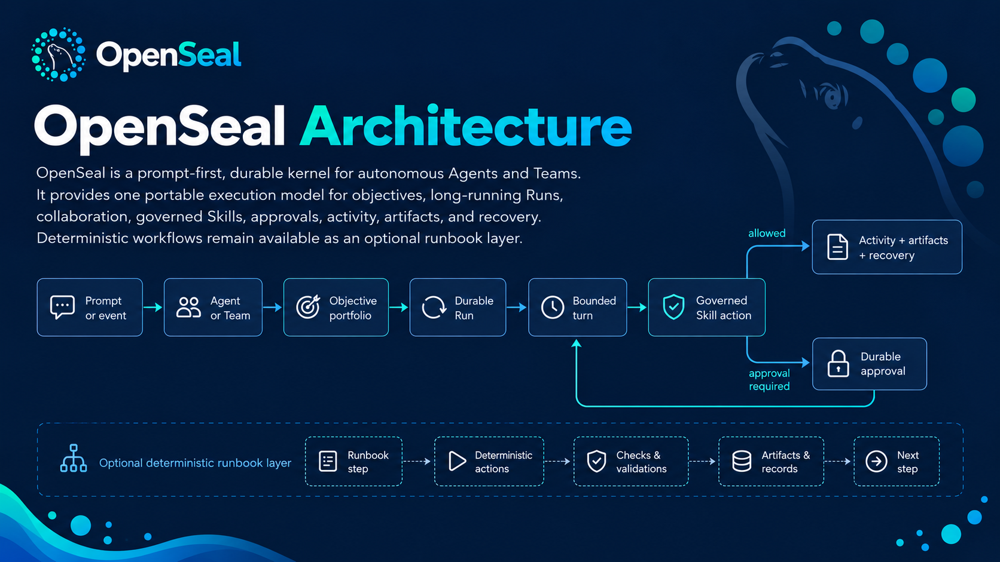

# OpenSeal



OpenSeal is a prompt-first, durable kernel for autonomous Agents and Teams. It
provides one portable execution model for objectives, long-running Runs,
collaboration, governed Skills, approvals, activity, artifacts, and recovery.
Deterministic workflows remain available as an optional runbook layer.



## Choose a starting point

| If you want to… | Start here |
| --- | --- |
| Explore the desktop app | [Desktop quick start](#desktop-quick-start) |
| Run the daemon and terminal client | [Terminal quick start](#terminal-quick-start) |
| Build a client or embed the Go kernel | [User documentation](docs/user-docs/index.md) and [developer documentation](docs/dev-docs/README.md) |

The terminal path starts without a model provider. Model-backed proposal generation
needs a [standalone context](docs/user-docs/configuration.md), and workforce
evaluation and installation need the authenticated desktop mode or an embedding
host. The API reports available operations at `/api/v1/capabilities`.

## Terminal quick start

Prerequisites: Go 1.26 and a C toolchain for SQLite (`gcc` or `clang`).

```bash
git clone https://github.com/axiom-studio/openseal.git
cd openseal
make build

./openseal daemon --config ./local.yaml
```

In another terminal:

```bash
./openseal
```

Running `openseal` without a subcommand opens the TUI. The TUI is a thin client:
closing it does not stop work. The generated configuration stores kernel state
in `data/openseal.db` and artifact content in `data/artifacts`, relative to the
configuration file. See the [first-run guide](docs/user-docs/getting-started.md)
for provider setup, capabilities, and storage locations.

## Desktop quick start

The desktop app is in development. It includes Home, Agents, Teams, Work,
Reviews, Channels, and model provider settings. It requires `pnpm`, Rust,
Tauri prerequisites, Go, and a C toolchain. See the
[desktop guide](desktop/README.md) for setup and platform requirements.

Start the graphical app:

```bash
make desktop-install
make desktop-dev
```

The native host starts an owned daemon on an ephemeral loopback port and keeps
the per-launch bearer token in native memory. Set a model provider in Settings
to generate proposals. The desktop can then review and install them through
its local owner flow.

The TUI uses an outcome-first Agent workspace: **Home** makes the next action
obvious; **Create**, **Agents**, **Teams**, **Marketplace**, **Work**, and
**Channels** are the primary destinations; and `?` opens help from anywhere.
Use the left/right arrows to change pages. Workforce and channel composers use
Enter to submit and Shift+Enter for a new line.

`context.yaml` is standalone OpenSeal's local Vault alternative. It maps opaque
credential references to environment variables or owner-only files; secret
values never enter prompts, durable state, capability responses, or the TUI.
See [Standalone context and local Vault](docs/dev-docs/standalone-context.md).

The generated local configuration uses the loopback API at
`http://127.0.0.1:8080`.

Docker Compose is also supported:

```bash
make docker-up
make docker-logs
# API: http://localhost:8080/api/v1
make docker-down
```

## Standalone deployment boundaries

Standalone OpenSeal provides a local workspace while keeping host-managed
infrastructure outside the local process:

| Capability | Standalone OpenSeal | Embedding host |
| --- | --- | --- |
| Agents, Teams, Work, Channels, evidence | Native kernel and capability API | Same portable contracts with hosted adapters |
| Composer and governed review | Local model provider for generation; desktop mode for owner review and installation | Host-managed model grants and lifecycle authority |
| Skills marketplace | ClawHub discovery and verification; install and update with `--standalone-operator` | Host marketplace policy and organization catalogs |
| Credentials | Scope-isolated env/private-file references | Vault/KMS-backed grants, leases, identity, and rotation |
| Multi-user policy and approvals | Not emulated by the local context | Host identity, authorization, policy evaluation, and audit |

The TUI renders only operations advertised by the connected server. This keeps
the standalone experience complete for its configured local authority without
silently manufacturing identity or policy decisions owned by an embedding
host.

## What is implemented

- Versioned Agent definitions and durable Agent deployments
- First-class Teams with semantic roles, roster assignments, policy, and
  Team-owned Skill bindings
- Multi-objective portfolios, Projects, schedules, event routing, and
  durable Runs with bounded leases and checkpoints
- Typed Skill definitions, least-privilege deployment bindings, action
  approvals, credential references, and execution-time secret boundaries
- OpenClaw/ClawHub source compilation, verified installation, updates, pins,
  uninstall, provenance, and restart restoration
- Agent requests, handoffs, dependency groups, Team channels, participation
  arbitration, cursors, presence, and shared activity
- Immutable artifact metadata, verified local content storage, source evidence,
  and governed outreach records
- SQLite for standalone durability and PostgreSQL for embedded deployments
- Capability-discovered REST API, prompt-first TUI, and stable Go facade
- Optional process-bounded HCL runbooks through `openseal run`

The standalone daemon advertises only operations it has been configured to
execute. Prompt-to-workforce authoring requires a complete model configuration;
review and installation additionally require desktop or host lifecycle authority.
Clients should read `/api/v1/capabilities` instead of assuming a fixed surface.

## Documentation

Choose the guide for the task at hand:

| Task | Guide |
| --- | --- |
| First local run and terminal navigation | [Getting started](docs/user-docs/getting-started.md) and [CLI reference](docs/user-docs/cli.md) |
| Understand Agents, Teams, Runs, and Skills | [User documentation](docs/user-docs/index.md) |
| Configure providers, credentials, and security | [Configuration](docs/user-docs/configuration.md) and [Security boundaries](docs/user-docs/security.md) |
| Work on the kernel or integrate the API | [Developer documentation](docs/dev-docs/README.md) |
| Develop the graphical app | [Desktop guide](desktop/README.md) |

The user guides explain supported behavior; the developer guides explain
implementation, extension points, and verification. Both use the running
capability document as the authority for conditional operations.

## Library embedding

Use `github.com/axiom-studio/openseal/pkg/openseal` as the supported Go facade.
Do not import `internal` packages.

```go
store, err := openseal.NewSQLiteStore("openseal.db")
if err != nil {
    return err
}
defer store.Close()

engine, err := openseal.New(openseal.WithPersistentStore(store))
if err != nil {
    return err
}
engine.Start(ctx)
defer engine.Stop()
```

An engine defaults to an in-memory store. Use an explicit persistent store for
durable work and configure the Agent and action workers required by the
deployment. See the
[architecture guide](docs/dev-docs/architecture/autonomous-agent-runtime.md) for the
adapter boundary.

## Development

```bash
make test
make vet
```

Optional live tests are documented in [Operations](docs/dev-docs/operations.md). They
are not part of the default deterministic test suite.

## License

Apache License 2.0 — see [LICENSE](LICENSE).
