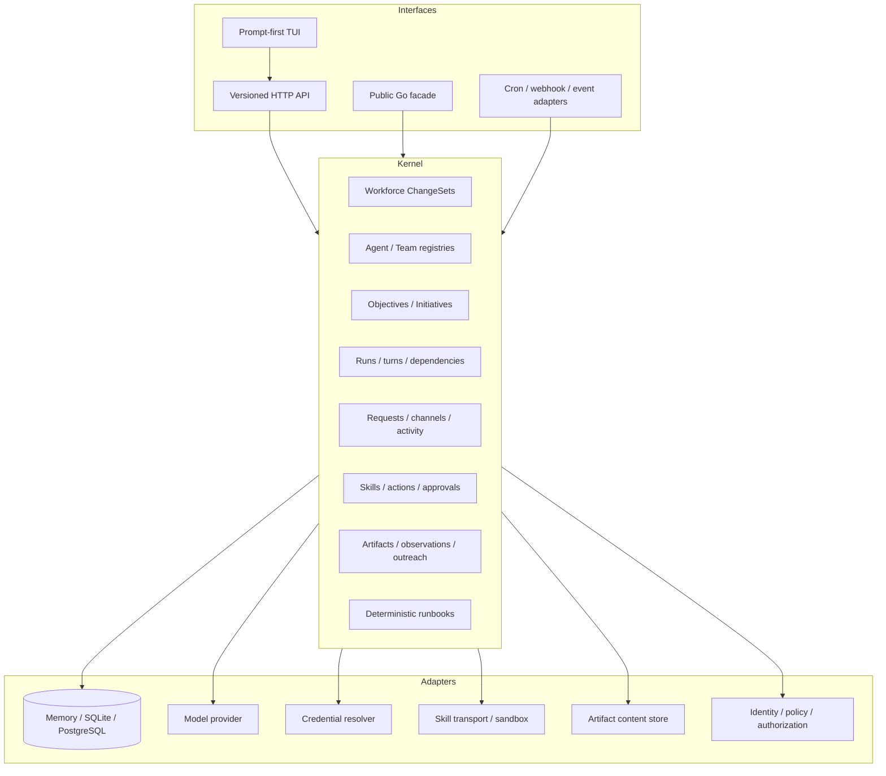
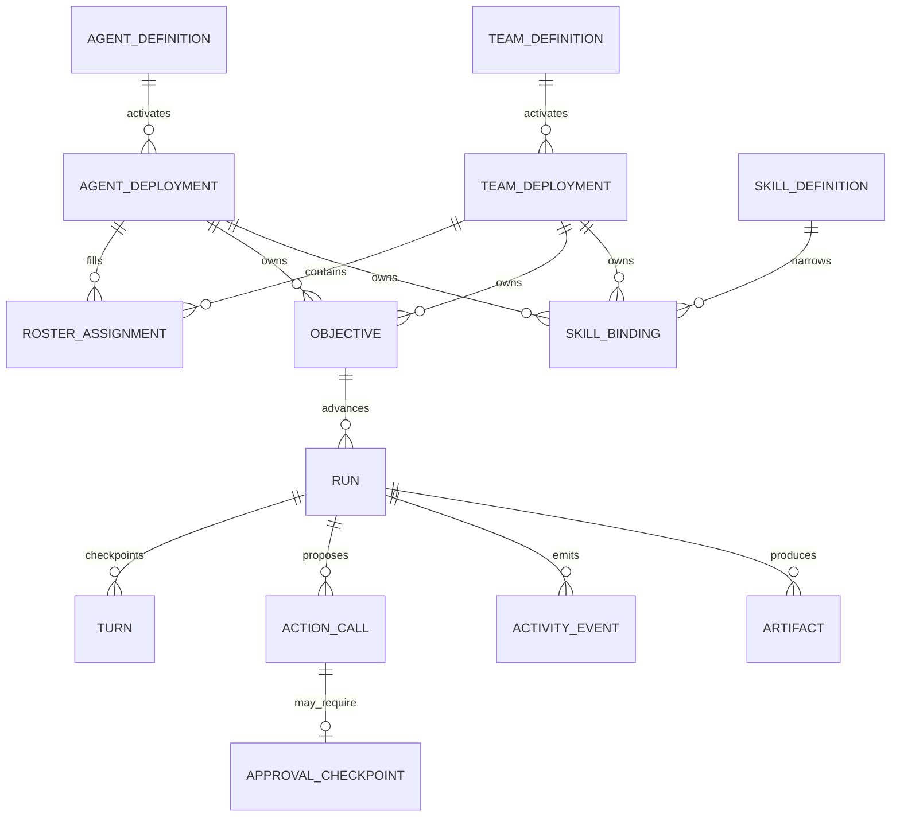
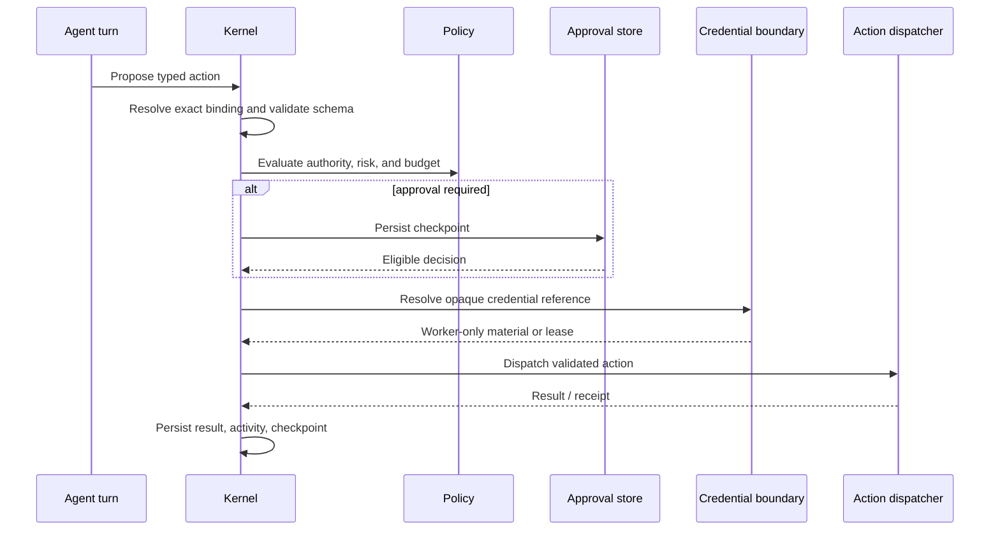

# Autonomous agent runtime architecture

This document describes the OpenSeal architecture implemented in this
repository. It separates portable kernel guarantees from optional standalone
and embedding adapters.

## Runtime layers

`github.com/axiom-studio/openseal/pkg/openseal` is the supported embedding
facade. The standalone daemon constructs the same `Engine`, adds SQLite and
local artifact storage, registers its optional adapters, and exposes it through
`/api/v1`. Downstream programs should not import OpenSeal `internal` packages.

## Canonical resource graph

References are validated inside an explicit scope. Definitions are immutable
and versioned. Deployments are mutable activations with optimistic revisions.
Agents and Teams are peer owners of objectives, Runs, Skills, activity, and
artifacts; Teams additionally add roster and collaboration policy.

## Prompt-first authoring

Natural-language authoring compiles to a durable **Workforce ChangeSet**, not a
direct registry mutation. The ChangeSet stores the original request,
generation Run, candidate, typed refinements, exact Skill placement,
validation diagnostics, policy findings, approval requirements, decisions,
revision, digest, and apply receipt.

Generation is claimed by a leased worker and can recover after process failure.
The candidate may contain one Agent, several Agents, a Team, objective
templates, Skill requirements, and an Initiative blueprint. The compiler never
invents a credential value, source allowlist, or approval authority.

Application is atomic in persistent stores: reviewed Agent/Team definitions,
deployments, objective instances, Skill bindings, Initiative records, and the
receipt commit together. Expected revision, candidate digest, and idempotency
key prevent stale or duplicate application.

## Durable execution

OpenSeal models continuous autonomy as a sequence of bounded durable Runs and
turns, not one immortal model request.

1. A prompt, objective cadence, event, conversation command, request, or API
   call creates or wakes a Run.
2. The scheduler selects an eligible Run subject to status, dependencies,
   wake conditions, priority, budget, and concurrency.
3. A worker claims it with a bounded lease.
4. The worker loads the exact Agent/Team definition versions, checkpoint,
   objective, policy, and active Skill surface.
5. One turn records a bounded result: continue, wait, request, propose an
   action, complete, or fail.
6. State and activity commit before the next claim.
7. Waiting work holds no worker. Lease expiry makes interrupted work
   reclaimable from its last checkpoint.

Independent Runs and child Runs provide concurrency. One claimed Run remains
single-writer. Budget reservations and idempotent action records prevent
duplicate spend and duplicate side effects across retries.

## Multi-objective scheduling and events

Each Agent or Team can own a portfolio of objectives. Objective cadence
reconciliation uses a persisted schedule cursor and deterministic occurrence
keys. A due cadence creates the configured bounded Run template. Normalized
event routing matches active objective subscriptions and applies persisted
deduplication keys before creating or waking Runs.

Source monitors use the same model: a long-lived monitor definition and
checkpoint produce bounded observations and Runs. Kubernetes informers, message
streams, or other external listeners are host adapters that submit normalized
events; they are not alternate execution engines.

## Skills and action governance

The canonical Skill catalog is source-aware. Two definitions with the same ID
and version but different source identities remain distinct variants. Bindings
select the exact source-qualified definition, allowed actions, prompt exposure,
risk ceiling, configuration, constraints, and opaque credential references.

Action execution follows this order:

The model never receives resolved secret values. A host dispatcher is guarded
at the final external boundary as well as at proposal time. Team-owned actions
also validate the Team role grant and assigned Agent authority.

## Collaboration

Agent requests and handoffs create durable relationships between Runs. A Team
request can be assigned to one roster Agent under delegation policy. The
receiver keeps its own Skills, credentials, budgets, and policy.

The recipient inbox is a kernel reconciliation loop rather than a
human-authored Agent response. Creating a singular request and moving its source
Run into `waiting_for_agent` is one atomic store operation. Explicitly
preauthorized delegation is accepted idempotently; ordinary Turn delegation
uses recipient review. The inbox creates a bounded, decision-only Run owned by
the recipient. Agent recipients review their own request; Team recipients
choose the first eligible active roster assignment deterministically and honor
the active Team definition's acceptance policy. The decision Run may only
return `accept`, `reject`, or `request_clarification`; action execution,
forking, and further delegation fail closed. Applying the decision verifies the
completed Run, assigned Agent, recipient owner, request identifier, and exact
request revision. Rejecting or requesting clarification atomically resumes the
source with a structured collaboration result. Providing an answer atomically
returns it to the wait state, and the new request revision receives a distinct
decision Run whose input contains the question and response. Accepted work is a
separate child Run, preserving a clear boundary between deciding to take work
and doing it.

Hosted turns receive both the source Run's remaining budget and a
`minimumChild` budget. The latter is a provider-neutral protocol floor for a
viable delegated or forked child, not a value users must put in prompts. Its
input and total-token dimensions expand deterministically to cover the current
Agent's authorized hosted envelope, including active Skill instructions, while
retaining conservative protocol baselines. Every positive bounded child
dimension must meet that floor, and the aggregate of a fork must fit the source
Run's remaining capacity. The kernel rejects an under-sized or over-allocated
proposal before creating requests or child Runs. An unbounded parent dimension
remains unbounded. If remaining capacity cannot fit the advertised floor, the
Agent must continue locally, finish with a bounded result, or surface that
constraint rather than creating doomed work.

Conversations persist messages, reply and mention structure, participant
cursors, leased presence, incremental change sequences, and participation
rounds. Arbitration records who was eligible, who was suppressed, and why. A
conversation Run reconciler can turn accepted channel participation into
ordinary Runs; messages remain a projection and command surface over canonical
work.

## Evidence and delivery

Activity is append-only and scoped. Run, action, approval, request, Team,
conversation, source, and artifact services emit the same activity envelope.
Clients can request compact projections and fetch detailed events without
exposing provider chain-of-thought.

Artifacts store immutable metadata, versions, hashes, provenance, retention,
and an opaque content reference. Content upload/download is an optional adapter.
Source monitoring stores normalized observations and monotonic checkpoints.
Governed outreach requires source evidence, a truthful public identity, an
external Skill action, policy, and an approval-aware delivery Run.

Short-lived files passed into an execution sandbox are not Artifacts. The
portable execution transport bounds their size and lifetime, exposes only
opaque identifiers, and is intentionally lost across process restart. A host
must promote any durable result into the Artifact catalog and content store.

## Storage implementations

- **Memory** is the default for programmatic construction and tests. It is not
  durable across process exit.
- **SQLite** is the standalone store. It persists the complete kernel surface
  in one database and is used by the daemon.
- **PostgreSQL** is the shared embedded store. It applies timestamp-versioned
  schema migrations under a migration lock and supports configurable pooling
  and schema names.

All stores implement the same scoped service contracts. Recovery tests cover
leases, retries, idempotency, cancellation, action state, collaboration,
conversation changes, source checkpoints, ChangeSet application, and artifacts.

## Capability truth

The HTTP server exposes a static route set but constructs its capability
document from the stores and adapters actually installed. Optional operations
such as Run creation, action approval resolution, workforce lifecycle
decisions, artifact content, ClawHub mutation, source policy lifecycle, and
outreach delivery are advertised only when wired.

The TUI loads that document before rendering its workspace. It does not
manufacture permissions, statuses, approval eligibility, or durable state. An
embedding graphical client must follow the same rule.

### Governed source authority

```mermaid
flowchart LR
    Prompt[Prompt and source scope] --> Draft[Exact credential-free policy draft]
    Draft --> Review[Authorized review]
    Review --> Register[Register immutable version]
    Register --> Activate[CAS activate lifecycle]
    Activate --> Resolve[Resolve exact active version per action]
    Resolve --> Decision[Host + path + method + item decision]
    Decision --> Dispatch[Governed transport]
    Activate --> Revoke[CAS revoke]
    Revoke -. immediately fails closed .-> Resolve
```

An authoring draft is not an active catalog entry. The compiler may surface an
exact server-supplied proposal when a requested monitor lacks authority, but it
keeps the ChangeSet blocked. Registration and activation are separate audited
operations. A fresh authoring pass can consume the version only after the
lifecycle reports it active. Source policies contain no credentials: a host may
resolve an opaque credential reference after authorization, outside this
portable policy contract.

## Extension boundary

The public facade exposes types and configuration options for persistent
stores, dynamic worker scopes, turn runners, action policy, approval
authorization, credential resolvers or leases, action dispatch, Skill discovery,
ClawHub registries, source artifact storage, conversation coordination, Team
management, and Skill management.

OpenSeal validates portable semantics and fails closed when a necessary adapter
is absent. It does not pretend to provide tenant identity, a host secret service,
remote sandbox provisioning, external network credentials, or organization
policy in standalone defaults.
