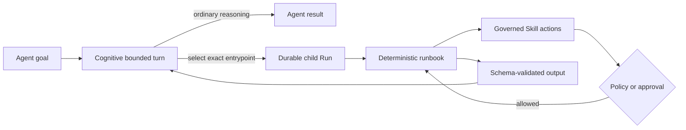

# Callable runbooks

OpenSeal Agents remain cognitive workers. A runbook does not replace an
Agent's prompt, objectives, or normal bounded turns. It defines a small,
deterministic operation that the Agent can invoke when exact sequencing is more
appropriate than model reasoning.



## Authoring

Prompt-first workforce creation may compile a runbook only when the requested
behavior is explicitly repeatable, exact, and deterministic. Research,
analysis, writing, planning, and conversation remain model-directed unless the
prompt also identifies a deterministic operation within that work.

Each callable entrypoint has:

- a stable name and description;
- a JSON Schema object for credential-free inputs;
- an optional JSON Schema object for durable outputs;
- an exact starting step in the immutable runbook graph.

```json
{
  "apiVersion": "openseal.dev/runbook/v1alpha1",
  "id": "release-evidence",
  "version": "1",
  "name": "Release evidence",
  "entrypoints": {
    "collect": "collect-sources"
  },
  "interfaces": {
    "collect": {
      "description": "Collect the evidence required for a release.",
      "inputSchema": {
        "type": "object",
        "additionalProperties": false,
        "properties": {
          "release": { "type": "string" }
        },
        "required": ["release"]
      },
      "outputSchema": {
        "type": "object"
      }
    }
  },
  "steps": {
    "collect-sources": {
      "kind": "action",
      "action": {
        "skillId": "release",
        "skillVersion": "1.0.0",
        "action": "collect",
        "arguments": {
          "release": { "ref": "/input/release" }
        },
        "resultPath": "/results/collect",
        "next": "done"
      }
    },
    "done": {
      "kind": "end",
      "end": {
        "outputs": {
          "evidence": { "ref": "/results/collect" }
        }
      }
    }
  }
}
```

Every action step must reference a Skill and action declared by the owning
Agent. Runbook interfaces cannot contain credentials or external schema
references.

Before activation, OpenSeal also verifies the graph against its exact installed
Skill bindings, opaque credentials, authority, approval routes, and budget
ceilings. See [Runbook activation verification](runbook-verification.md).

## Execution and recovery

The hosted turn receives only the callable interfaces, not permission to edit
the graph. When the Agent selects an entrypoint, the kernel:

1. validates the exact entrypoint and input schema;
2. creates a durable child `agent_work` Run;
3. executes deterministic steps and proposes each Skill action through normal
   policy, approval, idempotency, and audit controls;
4. validates the terminal output schema;
5. returns the child result through dependency fan-in so the cognitive parent
   can continue.

The parent and child checkpoints survive process and pod restarts. A normal
Agent turn with no selected entrypoint stays model-directed.
