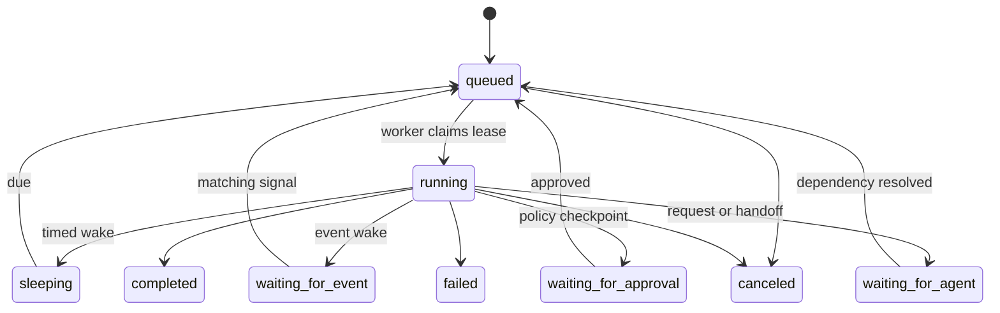

# Core concepts

OpenSeal uses a small set of versioned, scoped resources for individual work,
teamwork, capability execution, and audit. Chat, schedules, events, and API
commands enter the same durable execution model.

## Scope and ownership

Every user-facing runtime resource belongs to a `kind:id` scope such as
`local:research` or `tenant:acme`. A scope is a storage and policy boundary; it
is not inferred from a resource name.

Objectives and Runs have an owner:

- `agent:<id>` for an individual Agent deployment
- `team:<id>` for a Team deployment

Agents and Teams are both first-class owners. A Team is not implemented as a
special chat session.

## Agents

An **Agent definition** is immutable, versioned behavior: identity, purpose,
instructions, declared Skill requirements, objective templates, evaluation
criteria, and policy ceilings.

An **Agent deployment** activates one definition version in a scope. It holds
mutable runtime placement, status, capacity, restrictions, health, and Skill
bindings. Activations and rollbacks use expected revisions. Behavior changes
use durable amendments with proposal, evaluation, decision, and activation
records.

Definitions never contain live credential values. Deployments refer to opaque
credential bindings resolved only at an execution boundary.

## Teams

A **Team definition** describes semantic roles, coordination, delegation,
approval policy, shared context, objective templates, evaluation criteria, and
amendment policy. A **Team deployment** owns a roster that assigns Agent
deployments to those roles.

Roles express responsibility and channel participation. They do not implicitly
grant credentials or approval authority. A Team can own its own Skill bindings;
the runtime still dispatches work through an assigned roster Agent and checks
both Team role authority and the Agent's exact bound authority.

Team definitions also follow a governed amendment lifecycle. Runtime Team
management actions are ordinary typed Skills when enabled by an embedding host,
so a model cannot mutate a Team by bypassing validation and policy.

## Objectives and Initiatives

An **Objective** is a persistent desired outcome owned by one Agent or Team.
Owners may hold many active objectives at once. Objectives include priority,
status, success measures, constraints, budgets, dependencies, and optional
cadence.

An executable cadence contains a bounded Run template, not just an interval.
Schedule reconciliation creates idempotent Runs from due objective occurrences.
Event routing can also create or wake Runs from normalized events.

An **Initiative** groups objectives and delivery context into one durable
project. Implemented Initiative records can link milestones, hypotheses, source
monitors, deliverables, and existing objectives. They are composed from shared
runtime primitives rather than using a separate execution engine.

## Runs, turns, and recovery

A **Run** is a bounded durable workstream. A Run records its goal, owner,
assigned Agent, source, policy snapshot, budget, checkpoint, wake condition,
dependencies, activity, and outcome. Commands can pause, resume, cancel, or add
guidance when the server advertises those operations.

A worker claims one eligible Run with a bounded lease. Each **turn** advances a
small part of the work and persists its result. Waiting work releases its worker.
After a process failure or lease expiry, another worker resumes from the durable
checkpoint rather than replaying chat as hidden state.

The runtime also supports dependency groups, fan-in rules, child Runs, Agent
requests, and handoffs. Receiving Agents execute with their own bindings; a
request never transfers raw credentials.

## Skills and bindings

A **Skill definition** is a versioned capability contract containing prompt
instructions, typed actions, requirements, resources, provenance, and
lifecycle metadata. An action defines JSON input/output schemas, risk,
permissions, credential requirements, timeout/retry behavior, and transport.

A **Skill binding** grants a particular Agent or Team deployment a narrowed
subset of that definition:

- exact Skill ID, version, and source identity
- allowed actions and prompt visibility
- maximum risk and field constraints
- non-secret configuration
- opaque credential references
- enabled/disabled state and revision

Registration does not grant execution. Installation does not grant execution.
Only a valid binding that activates against current host capabilities can
become model-visible.

When an action is proposed, OpenSeal validates its schema and exact binding,
evaluates policy, reserves budget, and either dispatches it or creates an
approval checkpoint. Credential material is resolved after authorization and
is never written to the definition, model-visible arguments, or activity.

## Approvals

An **approval checkpoint** records the exact proposed action, policy decision,
eligible principals, expiration, and continuation. Approval is not a general
grant: resolving one checkpoint permits only that reviewed action and the Run
continues under its original binding.

Workforce ChangeSets and Agent/Team amendments use their own governed lifecycle
records. They bind decisions to an exact revision and candidate digest so stale
reviews cannot activate changed content.

## Conversations and collaboration

A **conversation** is a durable channel and command/observation surface. Its
messages can reference Runs, approvals, requests, decisions, handoffs, and
artifacts without duplicating those records.

OpenSeal persists structured message intent, audience, mentions, reply
relationships, delivery/read cursors, participation rounds, and leased
presence. Participation arbitration uses relevance, novelty, duplicate
suppression, speaker bounds, cooldown, and role policy. This keeps Team
channels useful without forcing one permanent spokesperson or allowing every
Agent to answer every message.

An **Agent request** is durable delegated work, not a chat instruction. Incoming
requests are reconciled through recipient policy. Ordinary Turn delegation
places the requesting Run in `waiting_for_agent` and creates a small,
decision-only Run for the recipient Agent; only explicitly preauthorized policy
skips that review. A Team request deterministically selects one eligible roster
Agent under the active Team role and delegation policy. That Agent can accept,
reject, or ask one concrete clarification question. Rejection resumes the
requester with the durable reason. A clarification question also resumes it;
the requester can answer through the same request, wait again, and receive a
new decision Run bound to the new request revision. The decision Run cannot
execute Skills, fork, delegate, or perform the requested work. Accepted work
then starts as a separate child Run with its own Skills, credentials, budget,
policy, and audit trail.

## Activity, artifacts, and evidence

Meaningful state changes append scoped activity events with actor, causation,
correlation, visibility, and resource references. The activity feed projects
these events into compact summaries; it does not expose private provider
chain-of-thought.

Artifact metadata is immutable and versioned. Content is held by a configured
content store and verified by size and SHA-256 digest on download. Source
observations preserve provenance and checkpoints for restart-safe monitoring.
Governed outreach links a public identity, source evidence, an authorized
external Skill action, approval policy, delivery Run, and provider receipt.

## Deterministic workflows

HCL workflows are optional, process-bounded runbooks. They can be created,
validated, and run explicitly with the CLI. The daemon does not load, schedule,
or expose them through hidden APIs. Durable autonomous work uses Agent
definitions, objectives, Agent Runs, objective schedules, event-source
subscriptions, and governed Skills.
