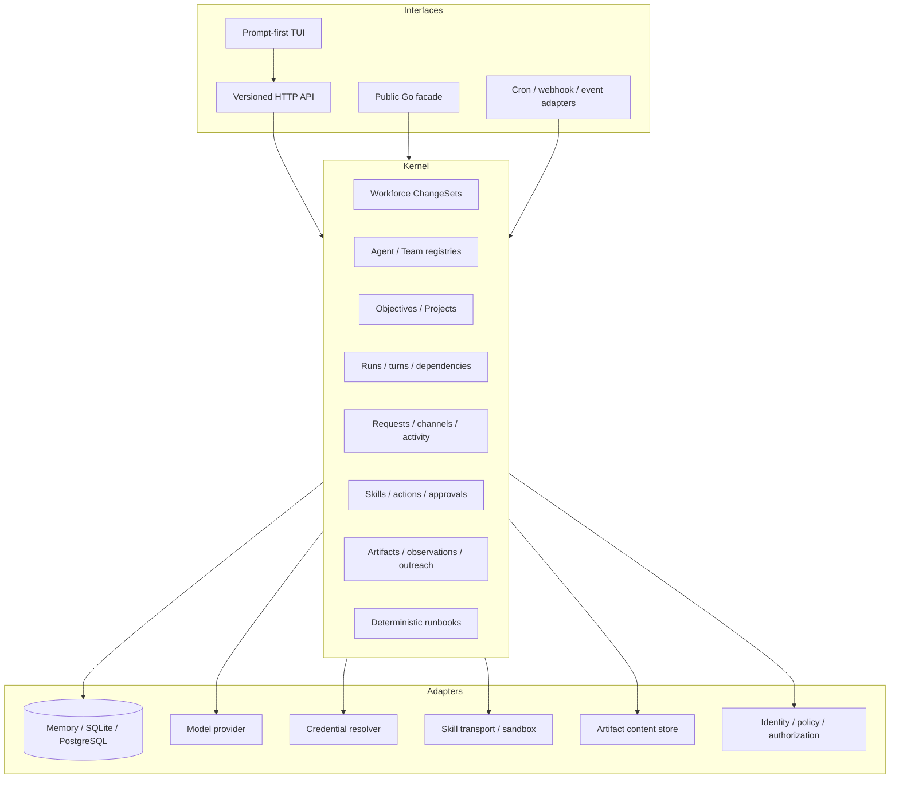
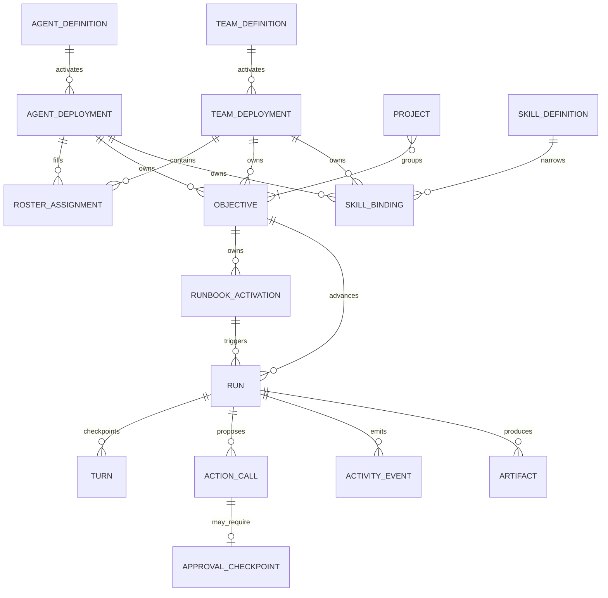
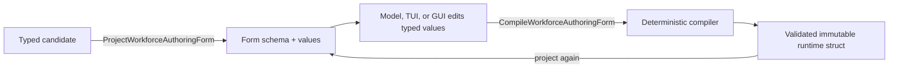
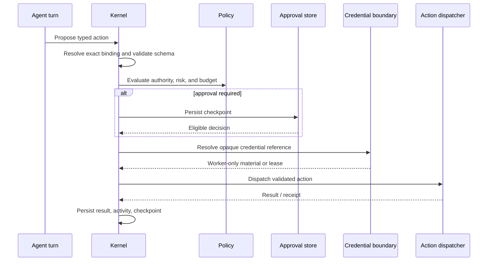

# Autonomous agent runtime architecture

This document describes the OpenSeal architecture implemented in this
repository. It separates portable kernel guarantees from optional standalone
and embedding adapters.

## Runtime layers

`github.com/axiom-studio/openseal/pkg/openseal` is the supported embedding
facade. The standalone daemon constructs the same `Engine`, adds SQLite and
local artifact storage, registers its optional adapters, and exposes it through
`/api/v1`. Downstream programs should not import OpenSeal `internal` packages.

## Canonical resource graph

References are validated inside an explicit scope. Definitions are immutable
and versioned. Deployments are mutable activations with optimistic revisions.
Agents and Teams are peer owners of objectives, Runs, Skills, activity, and
artifacts; Teams additionally add roster and collaboration policy.

### Team coordination

Team channels use one relevance-arbitrated coordination model. There is no
leader-only, peer, or dynamic mode switch: those labels previously projected
the same runtime and made the contract misleading. Every active participant
observes the shared channel context and may propose a contribution. The
deterministic arbiter then applies the Team's explicit controls:

- quiet-by-default materiality;
- required or preferred role relevance;
- duplicate-content suppression;
- maximum speakers and concurrency;
- audience, mention, thread, and role-participation boundaries.

Leaders can coordinate through an ordinary semantic role and relevant
handoffs, summaries, or decisions, but they are never mandatory spokespeople.
Exact governed actions remain idempotently deduplicated even when repeated
conversation content is allowed.

## Prompt-first authoring

Natural-language authoring compiles to a durable **Workforce ChangeSet**, not a
direct registry mutation. The ChangeSet stores the original request,
generation Run, candidate, typed refinements, exact Skill placement,
validation diagnostics, policy findings, approval requirements, decisions,
revision, digest, and apply receipt.

Generation is claimed by a leased worker and can recover after process failure.
The candidate may contain one Agent, several Agents, a Team, objective
templates, Skill requirements, and a Project blueprint. The compiler never
invents a credential value, source allowlist, or approval authority.

Models and product surfaces do not edit compiler-owned kernel fields. OpenSeal
projects typed structs into a versioned authoring form whose fields carry
labels, help, input kinds, choices, and enablement conditions. The submitted
form contains typed values keyed by stable field and subject identifiers. A
deterministic codec validates those values and derives the immutable runtime
struct; the same codec projects that struct back into editable form values for
amendment and review.

For example, an endpoint form exposes an **Approvals** purpose only when its
authorized adapter accepts approval decisions. Selecting it compiles the exact
Agent approval destination. The model never writes `approvalDestinations`,
provider bindings, or principal mappings directly.

Application is atomic in persistent stores: reviewed Agent/Team definitions,
deployments, objective instances, Skill bindings, Project records, and the
receipt commit together. Expected revision, candidate digest, and idempotency
key prevent stale or duplicate application.

## Durable execution

OpenSeal models continuous autonomy as a sequence of bounded durable Runs and
turns, not one immortal model request.

1. A prompt, Runbook trigger, conversation command, request, or API
   call creates or wakes a Run.
2. The scheduler selects an eligible Run subject to status, dependencies,
   wake conditions, priority, budget, and concurrency.
3. A worker claims it with a bounded lease.
4. The worker loads the exact Agent/Team definition versions, checkpoint,
   objective, policy, and active Skill surface.
5. One turn records a bounded result: continue, wait, request, propose an
   action, complete, or fail.
6. State and activity commit before the next claim.
7. Waiting work holds no worker. Lease expiry makes interrupted work
   reclaimable from its last checkpoint.

Independent Runs and child Runs provide concurrency. One claimed Run remains
single-writer. Budget reservations and idempotent action records prevent
duplicate spend and duplicate side effects across retries.

## Multi-objective scheduling and events

Each Agent or Team can own a portfolio of Objectives. An Objective says what
outcome matters; one or more versioned Runbooks beneath it say how work is
performed. Activated Runbook schedule triggers own persisted cursors, cron
jitter, concurrency, inputs, policy, and deterministic occurrence keys. A due
trigger creates a bounded Run attributed to both the Objective and the exact
Runbook activation. Normalized event routing matches active Runbook event
triggers and applies persisted idempotency keys before creating Runs.

Source monitors use the same model: a long-lived monitor definition and
checkpoint produce bounded observations and Runs. Kubernetes informers, message
streams, or other external listeners are host adapters that submit normalized
events; they are not alternate execution engines.

## Skills and action governance

The canonical Skill catalog is source-aware. Two definitions with the same ID
and version but different source identities remain distinct variants. Bindings
select the exact source-qualified definition, allowed actions, prompt exposure,
risk ceiling, configuration, constraints, and opaque credential references.

Action execution follows this order:

The model never receives resolved secret values. A host dispatcher is guarded
at the final external boundary as well as at proposal time. Team-owned actions
also validate the Team role grant and assigned Agent authority.

## Collaboration

Agent requests and handoffs create durable relationships between Runs. A Team
request can be assigned to one roster Agent under delegation policy. The
receiver keeps its own Skills, credentials, budgets, and policy.

The recipient inbox is a kernel reconciliation loop rather than a
human-authored Agent response. Creating a singular request and moving its source
Run into `waiting_for_agent` is one atomic store operation. Explicitly
preauthorized delegation is accepted idempotently; ordinary Turn delegation
uses recipient review. The inbox creates a bounded, decision-only Run owned by
the recipient. Agent recipients review their own request; Team recipients
choose the first eligible active roster assignment deterministically and honor
the active Team definition's acceptance policy. The decision Run may only
return `accept`, `reject`, or `request_clarification`; action execution,
forking, and further delegation fail closed. Applying the decision verifies the
completed Run, assigned Agent, recipient owner, request identifier, and exact
request revision. Rejecting or requesting clarification atomically resumes the
source with a structured collaboration result. Providing an answer atomically
returns it to the wait state, and the new request revision receives a distinct
decision Run whose input contains the question and response. Accepted work is a
separate child Run, preserving a clear boundary between deciding to take work
and doing it.

Hosted turns receive both the source Run's remaining budget and a
`minimumChild` budget. The latter is a provider-neutral protocol floor for a
viable delegated or forked child, not a value users must put in prompts. Its
input and total-token dimensions expand deterministically to cover the current
Agent's authorized hosted envelope, including active Skill instructions, while
retaining conservative protocol baselines. Every positive bounded child
dimension must meet that floor, and the aggregate of a fork must fit the source
Run's remaining capacity. The kernel rejects an under-sized or over-allocated
proposal before creating requests or child Runs. An unbounded parent dimension
remains unbounded. If remaining capacity cannot fit the advertised floor, the
Agent must continue locally, finish with a bounded result, or surface that
constraint rather than creating doomed work.

Conversations persist messages, reply and mention structure, participant
cursors, leased presence, incremental change sequences, and participation
rounds. Arbitration records who was eligible, who was suppressed, and why. A
conversation Run reconciler can turn accepted channel participation into
ordinary Runs; messages remain a projection and command surface over canonical
work.

## Evidence and delivery

Activity is append-only and scoped. Run, action, approval, request, Team,
conversation, source, and artifact services emit the same activity envelope.
Clients can request compact projections and fetch detailed events without
exposing provider chain-of-thought.

Artifacts store immutable metadata, versions, hashes, provenance, retention,
and an opaque content reference. Content upload/download is an optional adapter.
Source monitoring stores normalized observations and monotonic checkpoints.
Governed outreach requires source evidence, a truthful public identity, an
external Skill action, policy, and an approval-aware delivery Run.

Short-lived files passed into an execution sandbox are not Artifacts. The
portable execution transport bounds their size and lifetime, exposes only
opaque identifiers, and is intentionally lost across process restart. A host
must promote any durable result into the Artifact catalog and content store.

## Storage implementations

- **Memory** is the default for programmatic construction and tests. It is not
  durable across process exit.
- **SQLite** is the standalone store. It persists the complete kernel surface
  in one database and is used by the daemon.
- **PostgreSQL** is the shared embedded store. It applies timestamp-versioned
  schema migrations under a migration lock and supports configurable pooling
  and schema names.

All stores implement the same scoped service contracts. Recovery tests cover
leases, retries, idempotency, cancellation, action state, collaboration,
conversation changes, source checkpoints, ChangeSet application, and artifacts.

## Capability truth

The HTTP server exposes a static route set but constructs its capability
document from the stores and adapters actually installed. Optional operations
such as Run creation, action approval resolution, workforce lifecycle
decisions, artifact content, ClawHub mutation, source policy lifecycle, and
outreach delivery are advertised only when wired.

The TUI loads that document before rendering its workspace. It does not
manufacture permissions, statuses, approval eligibility, or durable state. An
embedding graphical client must follow the same rule.

### Governed source authority

```mermaid
flowchart LR
    Prompt[Prompt and source scope] --> Draft[Exact credential-free policy draft]
    Draft --> Review[Authorized review]
    Review --> Register[Register immutable version]
    Register --> Activate[CAS activate lifecycle]
    Activate --> Resolve[Resolve exact active version per action]
    Resolve --> Decision[Host + path + method + item decision]
    Decision --> Dispatch[Governed transport]
    Activate --> Revoke[CAS revoke]
    Revoke -. immediately fails closed .-> Resolve
```

An authoring draft is not an active catalog entry. The compiler may surface an
exact server-supplied proposal when a requested monitor lacks authority, but it
keeps the ChangeSet blocked. Registration and activation are separate audited
operations. A fresh authoring pass can consume the version only after the
lifecycle reports it active. Source policies contain no credentials: a host may
resolve an opaque credential reference after authorization, outside this
portable policy contract.

## Extension boundary

The public facade exposes types and configuration options for persistent
stores, dynamic worker scopes, turn runners, action policy, approval
authorization, credential resolvers or leases, action dispatch, Skill discovery,
ClawHub registries, source artifact storage, conversation coordination, Team
management, and Skill management.

OpenSeal validates portable semantics and fails closed when a necessary adapter
is absent. It does not pretend to provide tenant identity, a host secret service,
remote sandbox provisioning, external network credentials, or organization
policy in standalone defaults.

### Channel participation opt-in

Embedding hosts can require explicit per-channel participation by setting
`RequireParticipationOptIn` on both the conversation scheduler and turn runner.
The engine rejects mismatched policies. The default remains compatible with
existing hosts. The desktop enables this policy on both components and exposes
explicit per-channel Team replies settings.

`ConversationService.UpdateConversation` accepts `ParticipationEnabled` under
revision control. Enabling records the channel's current sequence as a boundary:
only subsequent messages qualify. Repeated enabling preserves that boundary;
disabling and re-enabling skips messages received before the new boundary.
Archiving disables participation, and restoring a channel does not re-enable it.
The opt-in survives store restart. Queued turns recheck the canonical channel
before execution. Late Agent replies and proposed operations are discarded after
opt-out while reported model usage remains charged. Team round publication uses
revision checks to reject a round computed against an outdated channel.

Opt-out does not undo already completed work or cancel actions already admitted
for execution. Host authorization, participant eligibility, model budgets, and
usage accounting remain enforced by the desktop host.

### Metered team participation

A host that enables model-backed team rounds should configure a per-run
`ConversationRunSchedulerConfig.Budget` and a per-participant
`ConversationCoordinatorConfig.ProposalBudget`. The scheduler copies the host's
policy into each new run. Before execution, the turn budget planner reserves
input and output capacity for `MaximumParticipants`, independently of the current
roster. An insufficient remaining budget pauses the run before provider calls.
This conservative reservation permits roster changes within that maximum without
admitting more model work than the run can afford.

A proposal allowance requires `MeteredParticipationProposalProvider`. Each call
receives a private copy of the input/output allowance in
`ParticipationProposalContext.Budget`; the host must check input size and cap
model generation before making the request. It reports provider usage through
`MeteredParticipationProposal`, including any known usage when returning an
error. Usage is host-reported, never accepted from model-authored proposal fields.
Over-limit or invalid reports prevent publication. Valid reported overages are
still charged. The runtime cannot stop a provider from exceeding a limit that the
provider itself ignores.

The coordinator sums tokens, cost, and provider/validation time across attempted
proposals, including unavailable participants and discarded rounds. Elapsed turn
time remains wall-clock time. `CoordinateWithUsage` returns invocation usage even
when coordination fails; replaying a committed round makes no new calls. Durable
conversation runners retain that usage on retry, failed publication, and failed
outcomes. A committed round also records usage and its originating turn ID, so a
restart after round commit but before turn finalization can recover the charge.
Only that original turn recovers the recorded charge; later continuation turns
do not charge it again. Reconciliation of an already finalized turn uses the
existing idempotent turn accounting.

Unreported usage from a process crash before a round or turn is committed cannot
be reconstructed from this contract. Existing unmetered embedding providers
remain supported unless usage reporting or proposal allowances are required.
The desktop wires the provider adapter, canonical roster resolver, explicit UI/API
participation controls, reconciler, and conversation workers when its provider is ready.

### Desktop participation host adapters

`internal/daemon.DesktopConversationParticipants` resolves the current local Team
roster and its exact active definition. It excludes observe-only/disabled roles
and inactive Agents, rejects pending Team activation, checks Agent definitions
against role requirements, and enforces the participant limit. Definition and
scope mismatches fail closed. Deployment-specific model credentials are rejected
because this desktop adapter uses the workspace provider; no credential is
transferred through the participant binding.

`DesktopParticipationProvider` implements the metered contract using the existing
workspace provider transport. It checks eligibility before and after generation,
sends immutable Agent behavior plus Team/role context and audience-filtered
channel text, and requests one structured contribution or silence. This adapter
has no action executor; it cannot propose external actions or claim tool access.
A contribution is a non-broadcast reply linked to the original trigger, so the
conversation service enforces the original thread's visibility while letting its
author read the response.

Each invocation requires an explicit input/output allowance. The request uses a
conservative byte-based input estimate with protocol overhead, trims oldest
history before the trigger or instructions, discloses omitted history, caps
output at the smaller of the allowance and 4,096 tokens, rejects redirects, and
limits request/response bodies to 4 MiB. Valid provider usage is retained even
when structured output is rejected or membership changes. When usage is missing
or the request fails after being attempted, accounting conservatively charges the
estimated input and reserved output allowance. Oversized input rejected before a
request has no provider charge. No monetary cost is inferred without provider
pricing data.

Synthetic HTTP and real runtime integration tests cover privacy, budget settlement,
stale membership, role authority, invalid output, and provider failures. These
adapters are registered with desktop conversation workers when the provider is
ready. Channel settings persist explicit opt-in/off through revision-checked PATCH
and recovery-by-read after uncertain delivery. Configuration remains available
without a provider for opt-out; automatic coordination does not. Desktop clients
cannot inject manual participation proposals.

Desktop bounds are eight eligible participants, two concurrent proposals, 30
recent messages, and 16,000 input/2,048 output tokens per participant. Conversation
runs allow three turns, four attempts, 432,000 total tokens, 49,152 output tokens,
and 180,000 ms. Authored quiet-by-default, role-relevance, and duplicate-suppression
policies apply; authored maximum speakers narrows the host cap of three. New
rounds resolve current canonical policy; recovery of committed rounds reuses the
saved policy. Queued provider calls check channel revision before starting, so
changes stop unstarted proposals. Requests already sent can still incur charges;
reported usage is retained and stale publication is rejected.

Full Go suites/race checks, 106 desktop browser tests, and Linux native smoke passed
with synthetic providers. Live provider quality and other operating systems remain
unverified; this bounded integration does not certify overall app completion.
