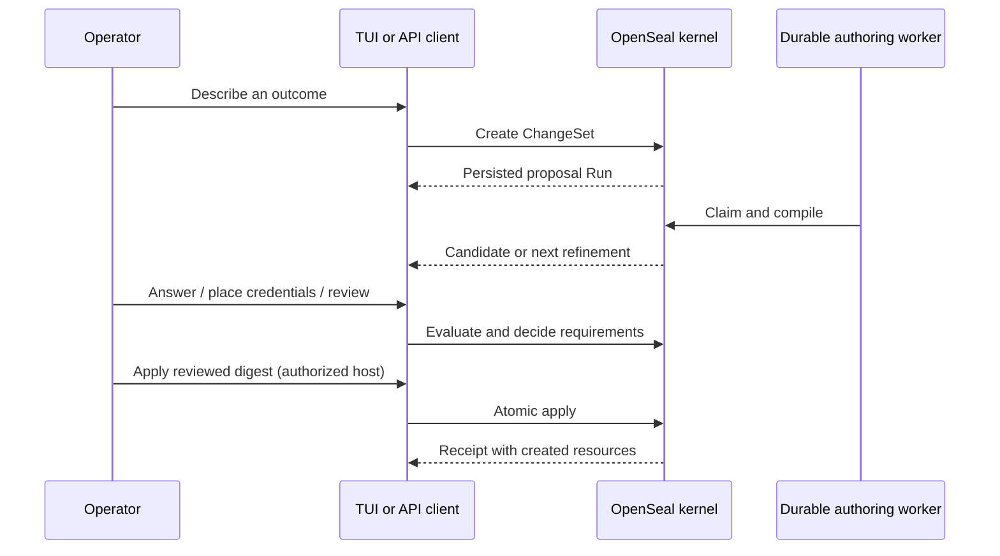

# Getting started

This guide starts one standalone OpenSeal daemon with durable local storage and
connects the terminal workspace to it.

## Requirements

- Go 1.26
- Git
- A C compiler and SQLite development toolchain (`gcc` or `clang`)
- A terminal with color and keyboard input for the TUI

Docker is optional.

## Build and verify

```bash
git clone https://github.com/axiom-studio/openseal.git
cd openseal
go version
make build
./openseal version
```

`make build` produces `./openseal`. Run the deterministic test and static
analysis gates when developing:

```bash
make test
make vet
```

## Start the daemon

Pass a path that does not yet exist to create a default local configuration:

```bash
./openseal daemon --config ./local.yaml
```

The generated file listens on `127.0.0.1:8080`, stores kernel state in
`data/openseal.db`, and stores artifact bytes in `data/artifacts`. Relative
paths are resolved from the configuration file's directory.

Check the process from another terminal:

```bash
curl -fsS http://127.0.0.1:8080/api/v1/health
curl -fsS http://127.0.0.1:8080/api/v1/capabilities
```

The first response is `{"status":"ok"}`. The second response is authoritative:
it lists the capability versions and operations available in this particular
daemon. An operation omitted from that document is not available.

> The repository's checked-in `daemon.yaml` and a generated `local.yaml` both
> use `127.0.0.1:8080` unless you explicitly change `api.listenAddr`.

## Open the terminal workspace

```bash
./openseal
```

No subcommand is equivalent to `./openseal tui`. Explicit configuration looks
like this:

```bash
./openseal tui \
  --endpoint http://127.0.0.1:8080 \
  --scope local:research \
  --owner team:research \
  --download-dir ./downloads
```

The workspace reads and mutates server state; it does not run a second kernel.
Exiting the TUI leaves the daemon and its durable work running. See the
[TUI guide](tui.md) for all sections and keys.

## Prompt-first workforce authoring

Standalone authoring uses a local context file so provider routing and opaque
credential references remain separate from durable kernel configuration. Copy
the safe template and supply the referenced environment variable:

```bash
cp context.example.yaml context.yaml
export OPENAI_API_KEY='...'
```

The YAML contains `baseURL`, `model`, and the opaque reference
`api-key/authoring-model`; it does not contain the API key. Environment and
owner-only file sources are resolved only when needed. See
[Standalone context and local Vault](standalone-context.md).

Start the local operator surface with an explicitly loopback listener:

```bash
# Set api.listenAddr to 127.0.0.1:8080 in local.yaml first.
./openseal daemon \
  --config ./local.yaml \
  --context ./context.yaml \
  --standalone-operator
```

`--standalone-operator` enables trusted local ClawHub mutations, refinement
answers, and generation retry
only when the API listen address is explicitly loopback, such as
`127.0.0.1:8080`. The default `:8080` wildcard is intentionally rejected. This
mode is not an authentication system. Credential placement exposes only the
context's secret-free display names and opaque references. Evaluation,
approval, and Apply still require an embedding host with explicit lifecycle
authority. Networked and multi-user deployments must supply identity,
authorization, and Vault/KMS-backed resolution through that boundary.

Authoring is a review process:



The model produces a candidate. OpenSeal validates it, records missing
requirements, and applies it only after required refinements, placement,
evaluation, and approvals resolve. The expected revision, candidate digest,
actor, reason, and idempotency key protect each governed transition.

## Use Docker Compose

```bash
make docker-up
curl -fsS http://127.0.0.1:8080/api/v1/health
make docker-logs
make docker-down
```

Compose mounts `docker/daemon.yaml` and a named volume for `/app/data`.
`make docker-down` uses `docker compose down -v` and therefore removes the
named data volume.

## Next steps

- Learn the resource model in [Core concepts](concepts.md).
- Use every command from the [CLI reference](cli.md).
- Integrate through the [REST API](api.md).
- Configure durable deployments using [Operations](operations.md).
- Import third-party Skills using [OpenClaw compatibility](skills/openclaw-compatibility.md).
