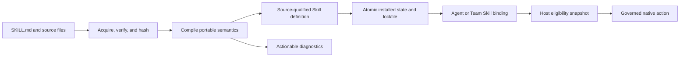

# OpenClaw skill compatibility

OpenSeal treats an OpenClaw/AgentSkills directory as a portable source format,
not as a separate execution runtime. The importer preserves the source artifact
and compiles behavior into native prompt, requirement, installer, resource,
transport, credential, policy, and provenance contracts.



The upstream references for this boundary are the current
[OpenClaw skills specification](https://docs.openclaw.ai/tools/skills) and
[OpenClaw skills CLI](https://docs.openclaw.ai/cli/skills). Registry operations
follow the versioned ClawHub API and its `clawhub.skill.verify.v1` verification
envelope.

## Use from standalone OpenSeal

Start the daemon in trusted loopback operator mode to enable registry
mutations, then open the Skills workspace:

```bash
# Set api.listenAddr to 127.0.0.1:8080 in local.yaml first.
openseal daemon --config ./local.yaml --standalone-operator
openseal tui --endpoint http://127.0.0.1:8080
```

Press `s` to open Skills. When the server advertises install authority, press
`n`, enter an exact registry reference such as `@owner/skill`, and submit with
`Ctrl+S`. The workspace shows installed state, verification, pins, and the
deployment bindings separately. Installing a Skill does not authorize an
Agent: create or edit an exact binding for the selected deployment before its
prompt or actions can activate.

The REST surface supports catalog detail, cursor-paginated versions, individual
files, verification, installation, installed-state inspection, update,
update-all, pin, unpin, installed verification, and uninstall. See the
[REST API guide](../api.md#skills-and-clawhub). The public Go facade additionally
exposes cursor-paginated search and explore clients, verified preview, source
artifact import/export, and the lifecycle methods used by the server.

## Compatibility guarantees

| Upstream semantic | OpenSeal representation | Guarantee |
| --- | --- | --- |
| `SKILL.md` identity and instructions | `Definition`, `PromptModule` | Native; invalid identity fails closed |
| Complete source directory | retained compiler artifact plus digested `Resource` index | Byte-exact export with mutation and digest checks |
| `license`, `homepage`, source version | `SourceProvenance` | Preserved |
| `user-invocable`, `disable-model-invocation` | `PromptModule` invocation policy | Native |
| `allowed-tools` | prompt tool allowlist and compiled action permissions | Native policy input |
| `command-dispatch: tool` | typed action plus `tool` transport | Native deterministic dispatch |
| `command-arg-mode: raw` | transport argument projection | Produces the upstream `command`, `commandName`, and `skillName` envelope |
| Unknown dispatch or argument modes | compiler error | Rejected explicitly; never silently degraded |
| `metadata.openclaw.always` | always-active prompt flag | Native |
| `skillKey` | definition configuration key | Preserved for binding/config adapters |
| `emoji` | definition icon | Preserved for presentation adapters |
| `primaryEnv` | credential requirement on deterministic actions | Secret value stays outside definitions, prompts, arguments, and activity |
| `requires.bins`, `anyBins`, `env`, `config`, `os` | typed requirements | Native eligibility input |
| legacy `metadata.clawdbot` | same typed metadata parser | Supported compatibility read |
| brew, node, go, uv, and download installer fields | typed installer candidates | Preserved; execution is an explicit host policy boundary |
| `references/`, `scripts/`, `assets/`, and other files | typed, media-aware, digested resources | Native progressive-disclosure inventory |
| `{baseDir}` | trusted per-skill activation resource root | Materialized only in the immutable deployment snapshot; missing/relative roots make the skill unavailable |
| per-agent allowlists and enablement | scoped `SkillBinding` | Native and revisioned |
| `skills.entries.*.config` | binding configuration | Native; configuration is scoped to the deployment |
| `skills.entries.*.env` and `apiKey` | opaque credential references and worker-time resolution | Native security boundary; raw values are never model-visible |
| session skill snapshots | deterministic activation snapshot ID | Stable across restart for equivalent bindings/host capabilities; host revision changes force refresh identity |
| workspace/project/personal/managed/bundled/plugin/extra roots | secure source catalog | Declared-name conflicts use documented precedence; one grouping level is supported |
| directory refresh | debounced effective-source watcher | Emits only when the winning skill surface changes; shadowed edits stay quiet |
| ClawHub search, explore, detail, versions, files, verify, archive | typed registry client | Native |
| verified preview before installation | secret-free compilation projection plus source, archive, and compilation digests | Native; install can require the exact reviewed receipt |
| ClawHub install, update, update-all, pin, verify, uninstall | verified atomic installer and lockfile | Native with local-modification and rollback protection |
| registry slug differing from declared skill name | source reference plus declared definition identity | Supported; registry identity remains provenance |
| local or Git acquisition | compiler bundle input | Acquisition adapter boundary; compilation semantics are identical |
| plugins that contribute skills | ordinary discovered skill directories | The skill is compatible; non-skill plugin capabilities remain plugin concerns |

## Security invariants

Third-party artifacts are untrusted. Registry installs require a passing
verification result unless an embedding application makes an explicit unsafe
choice. Archive extraction rejects traversal, symlinks, case-colliding paths,
oversized files, and oversized archives. Activation and action execution remain
separate: a verified install does not grant a model permission to invoke a
skill, resolve a credential, or perform a side effect.

The canonical tool dispatcher materializes only declared input mappings and
compiler literals. Credential values travel through a separate worker-only
channel. Persisted definitions, bindings, action proposals, approvals, and
activity contain requirement names or opaque credential references, never
resolved values.

## Host extension boundaries

OpenSeal owns secure multi-root precedence and effective-source refresh, while
the host chooses which concrete roots exist and which symlink targets it
trusts. Sandbox provisioning, installer execution, remote-node probing, Git
acquisition, and plugin discovery still depend on the host environment.
OpenSeal exposes typed contracts for these concerns without pretending that a
particular host implementation exists. An embedding application must advertise
and test each adapter it enables.

## Compiler result

A successful compilation contains a canonical definition, source provenance,
an immutable resource index, preserved installer candidates, and a round-trip
source artifact. Version identity incorporates source, origin, verification
trust, and process semantics so different registry or local sources cannot
silently collapse into one executable definition.

The compiler lowers deterministic constructs where their semantics are exact:

- Skill instructions become a native prompt module with invocation policy.
- Tool dispatch becomes a typed tool action and argument projection.
- Safe OpenAPI-described read operations can become typed HTTP actions.
- Declared command processes become argument-safe process contracts.
- Requirements, configuration, credentials, resources, and installers remain
  typed inputs to activation and host policy.

If safe native execution requires a host adapter that is not present, the
compiled action remains unavailable with an explicit diagnostic. Unknown
dispatch modes, unsafe paths, ambiguous source mutations, digest mismatches,
unsupported archives, and semantics that cannot be preserved fail closed.

## Lifecycle and updates

Installation writes to a staging area, verifies the archive and compilation,
then atomically publishes the installed directory and lockfile. Update compares
the installed source, verification, and local state; local modifications and
pins prevent an unreviewed replacement. Update-all reports each result instead
of hiding partial failures. Uninstall refuses unsafe or referenced removal
unless the caller uses the explicit governed force contract.

On Engine restart, installed Skills are reverified against their lockfile,
recompiled, and restored to the source-aware catalog. Existing bindings keep
their exact source-qualified identity rather than drifting to another variant.
