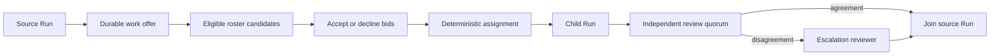

# Team coordination

OpenSeal coordinates Team work through the same durable primitives used by an
individual Agent. There is no second Team executor. A Team request, its child
Run, review Runs, channel projection, activity, budget, and artifacts all refer
to one collaboration fact.

## Work offers and assignment

When the recipient is a Team, request creation snapshots every eligible roster
candidate. Eligibility comes from the requested semantic role, the role's exact
Agent-definition and Skill requirements, active deployment state, and current
Run capacity. The snapshot contains no credentials.

Eligible Agents submit an explicit `accept` or `decline` bid with an idempotency
key. Assignment is deterministic: accepted candidates with available capacity
are ordered by available slots, then active Run count, then stable Agent
deployment identity. The selected Agent and the reason are persisted before the
child Run is created. A retry or another replica therefore cannot silently pick
a different worker.

The public Go facade exposes `SubmitAgentRequestBid`; request inspection returns
the candidate evidence, bids, and final assignment decision.

## Independent completion review

The Team delegation policy can require completion review, set a review quorum,
and require escalation when reviewers disagree. Reviewers must be Agents other
than the worker. Each decision is a durable, idempotent fact with a concise
evidence-based reason.

Review Runs are keyed by the immutable completion key, not by the collaboration
record's changing revision. That permits several reviewers and remains stable
across retries, restarts, and replicas. Agreement at quorum completes or rejects
the request. Conflicting decisions create an explicit disagreement checkpoint;
an additional independent reviewer resolves it.

## Channel behavior

Conversation projection reports offers, decisions, child work, reviews, and
completion without making chat the executor. Existing Team coordination policy
limits speakers, requires role relevance, suppresses duplicate content, and can
keep observers quiet by default. The durable request and Runs remain the source
of truth even when no participant needs to speak.

## Safety and recovery invariants

- Team role grants and Agent authority are both narrowing boundaries.
- Shared request context and artifacts cannot contain credentials.
- Budgets are allocated to the child Run and cannot exceed the source Run.
- Request, source Run, child Run, dependency resolution, and activity changes
  use transactional compare-and-swap storage operations.
- Idempotency suppresses duplicate requests, bids, decisions, child Runs, and
  completion reviews.
- Every decision retains the exact Team policy snapshot that governed it.

