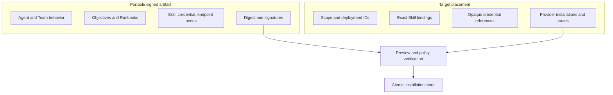

# Portable workforce bundles

A workforce bundle moves a reviewed group of Agents, Teams, Objectives, and
Runbook activations between OpenSeal kernels without copying host identity or
secrets. It is an immutable, deterministic artifact rather than a database
backup.

The bundle contains portable behavior, policy, exact Skill requirements,
credential *needs*, schedules, delivery declarations, compatibility metadata,
provenance, a content digest, and optional Ed25519 signatures. It never contains
deployment scopes, Run history, resolved credential values, provider
installations, callback URLs, or destination-local identifiers.


## Trust and placement boundary

Portable and target-owned data are deliberately separate:



The target chooses its own identities and bindings. A trusted signature proves
which portable bytes were reviewed; it does not grant target authority. Import
still validates caller policy, compatibility, exact placement, and reference
closure. A failed apply commits no prefix of the workforce.

## Go API

Use `openseal.ExportWorkforceBundle` with exact reviewed source resources. The
exporter resolves source deployment references to portable keys and fails when
a selected Team, Objective, or Runbook points outside the export.

```go
artifact, err := openseal.ExportWorkforceBundle(request)
if err != nil { /* selection was invalid or incomplete */ }

if err := openseal.SignWorkforceBundle(artifact, keyID, privateKey); err != nil {
    /* signing failed */
}

verification, err := openseal.VerifyWorkforceBundle(artifact, trustPolicy)
preview, err := openseal.PreviewWorkforceBundleInstallation(artifact, placement)
plan, err := openseal.CompileWorkforceBundleInstallation(importRequest)
receipt, err := openseal.InstallWorkforceBundle(ctx, atomicStore, importRequest)
```

`PreviewWorkforceBundleInstallation` is read-only. Compilation produces the
complete desired-state transaction and a stable plan digest. Installation is
available only when the host supplies one `WorkforceBundleInstallationStore`
whose method commits the whole plan atomically.

## CLI

```bash
openseal bundle validate workforce.yaml
openseal bundle inspect workforce.yaml
openseal bundle diff current.yaml target.yaml
openseal bundle plan-upgrade current.yaml target.yaml
```

All commands emit JSON. Validation verifies integrity and signature shape. A
target that requires trusted signing keys enforces that policy when compiling
or applying installation; a file's embedded public key is never implicitly a
target trust decision.

## TUI

When the kernel advertises `workforce-bundles/v1` with `inspect`, press `B` to
open **Bundles**. Press `Tab`, enter a local YAML path, and press `Ctrl+S`. The
TUI sends the decoded artifact to the kernel and displays its authoritative
inspection. It does not advertise installation unless the connected host
advertises and wires that operation.

## Upgrade and rollback

Bundles are immutable versions. `CompareWorkforceBundles` returns semantic
resource changes rather than a textual YAML diff. `PlanWorkforceBundleUpgrade`
binds the current and target digests, emits a stable idempotency key, and records
the current digest as the rollback target. Planning never mutates live state;
the target applies a reviewed plan through the same atomic installation seam.

## Failure behavior

- Digest mismatch, malformed signatures, broken portable references, duplicate
  keys, secret-shaped dynamic fields, and unsupported format revisions fail
  before placement.
- Missing target identities, Skills, bindings, credential references, endpoints,
  or callbacks appear as typed preview requirements.
- Trust policy is target-owned. Unknown or untrusted signing keys fail closed.
- Repeating the same bundle, placement, and idempotency key returns the same
  receipt. Reusing the key for a different plan is a conflict.
- The installation store is a whole-workforce transaction boundary; partial
  Agent or Team installation is not a valid outcome.
