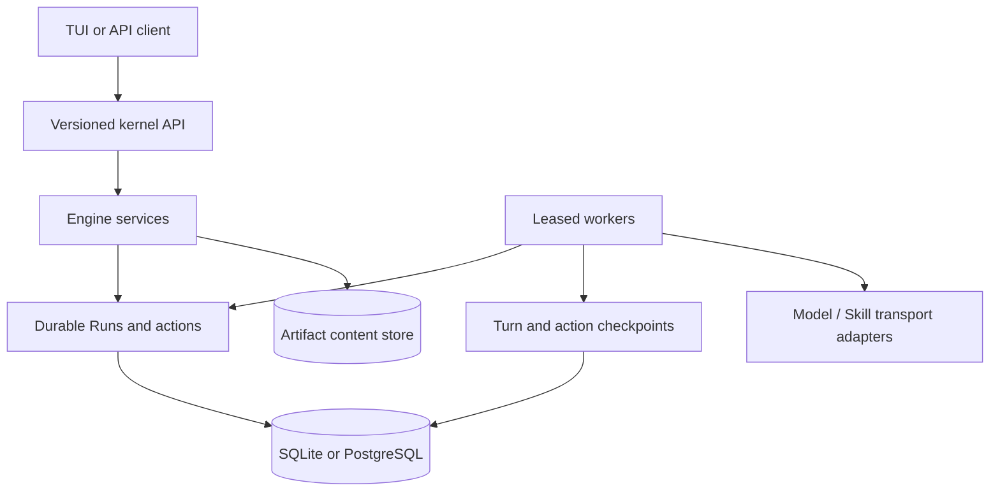

# Operations

This guide covers configuration, persistence, recovery, secrets, and test
commands for standalone and embedded OpenSeal deployments.

## Standalone daemon configuration

The daemon reads YAML. Missing files are created from defaults.

```yaml
workflowsDir: workflows
logLevel: info
storage:
  driver: sqlite
  path: data/openseal.db
  artifactsPath: data/artifacts
webhook:
  listenAddr: :9090
  baseURL: http://localhost:9090
api:
  listenAddr: :8080
triggers: {}
```

Only `sqlite` is accepted by the standalone configuration. Relative workflow,
database, artifact, and Skill paths are resolved from the configuration file's
directory. `OPENSEAL_SKILLS_DIR` overrides the daemon's default `skills`
directory.

The daemon starts two HTTP listeners:

- `api.listenAddr` serves the versioned kernel API.
- `webhook.listenAddr` serves trigger ingress and its `/health` endpoint.

Use `/api/v1/health` on the API listener for normal health checks.

## Model-backed authoring

Workforce authoring requires these settings as one complete group:

| Variable | Meaning |
| --- | --- |
| `OPENSEAL_LLM_BASE_URL` | OpenAI-compatible chat completions endpoint |
| `OPENAI_API_KEY` | Provider credential used by the authoring transport |
| `OPENSEAL_LLM_MODEL` | Exact provider model name |

If only one or two are set, daemon startup fails. If none are set, the daemon
starts without advertising workforce authoring. Provider credentials are
transport configuration; do not put them in Skills, prompts, ChangeSets,
activity, or checked-in YAML.

## Persistence and recovery

Standalone mode uses one SQLite store for definitions, deployments, objectives,
Runs, turns, leases, budgets, actions, approvals, collaboration, conversations,
activity, artifacts, Skills, ChangeSets, Initiatives, source checkpoints, and
outreach. Artifact bytes are stored separately beneath `artifactsPath` and tied
to immutable catalog records by size and digest.



For a graceful stop, send `SIGINT` or `SIGTERM`. OpenSeal stops trigger
registration, workers, and both HTTP servers. On restart it restores persistent
registries and installed ClawHub Skills. An expired Run or action lease is
reclaimable from its last durable checkpoint; idempotency keys protect repeated
commands and dispatch proposals.

Back up the SQLite database and artifact content together. Do not copy a live
database file without using a SQLite-safe snapshot procedure.

## Embedded PostgreSQL

The public facade includes a PostgreSQL store for shared deployments:

```go
store, err := openseal.NewPostgresStore(
    ctx,
    dsn,
    openseal.WithPostgresSchema("openseal"),
    openseal.WithPostgresPool(openseal.DefaultPostgresPoolConfig()),
)
```

Opening the store applies versioned migrations under an advisory migration
lock. Pool and migration-lock options are available through the facade. The
embedding host owns database credentials, backup, high availability, and
network policy.

## Capability and security boundaries

OpenSeal owns portable models, validation, durable orchestration, action and
approval state, exact Skill bindings, source provenance, and local stores. An
embedding host can supply:

- identity, scope, and authorization
- policy and eligible approval principals
- opaque credential selection and worker-time secret resolution
- model and Skill transports
- sandbox or remote execution
- artifact content stores and authorized resolvers
- source-policy persistence and network access
- event publication and external event sources

The host must advertise only operations it has actually wired. Secrets must be
resolved after authorization and schema validation. Do not log raw provider
responses when they can contain sensitive content.

## Source access and outreach

`sourcePolicies` in daemon YAML are credential-free, scope-bound network
authority used by configured source and outreach workers. A policy must specify
an ID, version, enabled state, one or more HTTPS hosts, a bounded maximum item
count, and optional path/method restrictions. Outreach additionally requires an
explicit approval policy and maximum body size.

Policy validation does not perform network I/O. Dispatch adapters must enforce
the exact decision on every request and redirect. Source policy configuration
does not itself provide API credentials or an HTTP provider implementation.

## Deterministic quality gates

```bash
make test
make vet
```

The default suite includes a three-Agent Snakes and Ladders acceptance test. It
exercises independent objective portfolios, a Team, child Runs, deterministic
actions, restart recovery, collaboration, a winner message, and a verified game
log artifact without external network calls.

Run race-sensitive kernel packages explicitly when changing concurrency:

```bash
go test -race ./pkg/runtime ./pkg/openseal
```

## Opt-in live tests

Live tests make real network or model calls and are excluded from the default
suite by the `integration` build tag. Configure credentials in the environment,
never in source files:

```bash
export OPENSEAL_LLM_BASE_URL=https://provider.example/v1/chat/completions
export OPENAI_API_KEY='replace-with-a-real-secret'
export OPENSEAL_LLM_MODEL='provider-model-name'

go test -tags=integration ./pkg/openseal \
  -run TestLiveThreeAgentSnakesAndLaddersUsesBoundedModelCommentary
```

The real ClawHub/model acceptance additionally requires an explicit opt-in:

```bash
export OPENSEAL_RUN_LIVE_E2E=1
# Optional; defaults to @nubzparmesan/minnow-writing
export OPENSEAL_E2E_CLAWHUB_SKILL='@owner/skill'

go test -tags=integration ./pkg/openseal \
  -run TestLiveClawHubSkillModelE2E
```

These tests verify that transport credentials are not persisted or exposed.
They should run against a controlled provider account with bounded spend.
