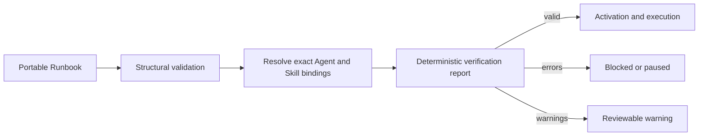

# Runbook activation verification

OpenSeal proves a Runbook in two stages before installed work can execute.
Structural validation proves the portable graph and schemas. Resolved
verification then proves the graph against the exact Agent definition, Skill
versions, deployment bindings, opaque credential references, authority,
approval routes, and budgets present at activation time.



The verifier is deterministic and has no access to secret values. Credential
requirements are compared only with opaque references containing a credential
kind and identifier. Running the same definition and resolved environment
produces the same source-addressed diagnostics in the same order.

## What is proved

Activation-blocking errors cover:

- entrypoints without a complete path to an end step;
- missing or ambiguous exact Skill action bindings;
- disabled or unauthorized actions and risk above binding authority;
- missing opaque credential bindings;
- mutating actions without idempotency support;
- required approvals without a reachable reviewed route;
- trigger budgets too small for a complete path;
- child allocations above their parent ceiling; and
- aggregate `join: all` branch allocations above their trigger ceiling.

Destructive actions without a declared compensation action produce a warning.
Warnings remain visible but do not make the report invalid.

## Lifecycle enforcement

Prompt-first authoring runs verification after placement has resolved installed
Skills and deployment bindings. An active candidate cannot become ready while
the report contains errors. Existing installed Runbooks expose the same report
from `GET /api/v1/runbooks/{activationID}` and the TUI Runbook inspector.

Manual execution repeats the proof before creating a Run. The schedule and
event reconcilers also repeat it: if an installed binding or approval route has
drifted, the activation is paused instead of emitting unsafe work. This is a
defense-in-depth check; execution-time action policy and credential leasing
still govern every individual action.

Low-level embedders that deliberately use scheduling without an installed
Agent catalog can continue to use structural Runbook primitives. Once an
activation is attached to an installed Agent definition, the complete resolved
proof is mandatory.

## Go API

Use the public facade types and function:

```go
report := openseal.VerifyRunbook(definition, openseal.RunbookVerificationEnvironment{
    Actions: []openseal.RunbookResolvedAction{/* secret-free resolved facts */},
})
if !report.Valid {
    // Present report.Diagnostics and do not activate.
}
```

Hosts should build the environment from one immutable catalog snapshot. Never
infer action identity from names, silently choose between multiple bindings,
or include credential values in the environment or diagnostics.

